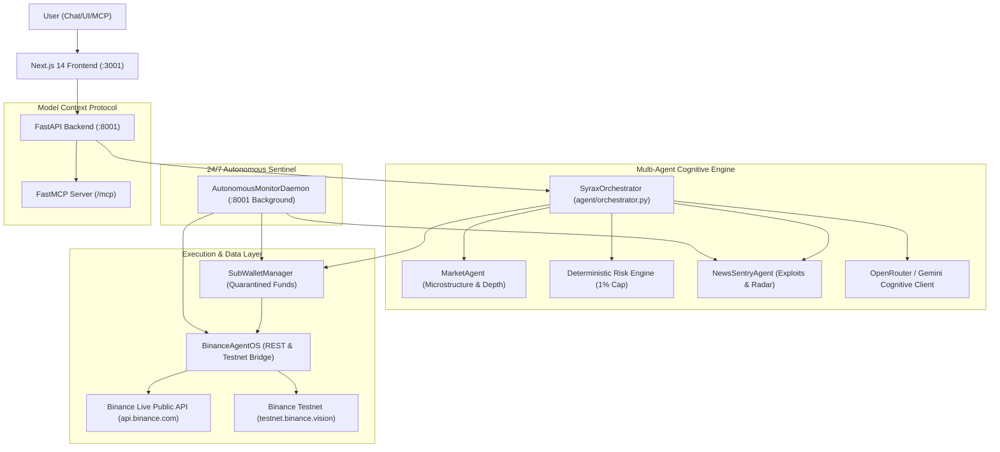

# SYRAX — AI Trading & Portfolio Agent
## Complete Project Context & System Architecture

---

### 1. SYRAX Product Goal
**SYRAX** is an autonomous, agentic AI Trading & Portfolio Intelligence system designed for the **Binance Agent OS Hackathon**.
- **Core Philosophy**: *"Most trading bots try to trade more. SYRAX tries to make better decisions — and knows when not to trade."*
- **Four Core Pillars**: **Research $\rightarrow$ Reason $\rightarrow$ Risk $\rightarrow$ Execute**.
- **Core Capabilities**:
  - Continuous 24/7 market monitoring and sentiment surveillance.
  - Multi-agent reasoning pipeline combining market microstructure analysis, mathematical risk gates, and breaking news/exploit radars.
  - Natural Language Conversational Interface (English & Banglish) supporting complex commands, portfolio queries, and automated order execution.
  - Isolated Sub-Wallet architecture with strict mathematical risk ceilings and customizable user trading mandates.

---

### 2. Hackathon Target
- **Target Event**: Binance Agent OS Hackathon / Agentic Web3 Track.
- **Protocol / Framework**: Official Binance Agent OS tool contracts, Model Context Protocol (MCP) Server integration (`/mcp` SSE endpoint), and Binance Public & Testnet REST APIs.
- **Key Judging Criteria Met**:
  1. Autonomous multi-agent coordination.
  2. Strict risk management & capital protection (anti-hallucination, mandatory stop loss, risk per trade $\le$ 1%).
  3. Real-time Binance market data integration and live orderbook telemetry.
  4. Real-time news & exploit sentry radar for emergency capital preservation.
  5. Native MCP (Model Context Protocol) tool exposure for external LLMs / agents.

---

### 3. Current Implemented Features

1. **AI Orchestrator Pipeline (`agent/orchestrator.py`)**:
   - Multi-agent cognitive pipeline running across specialized agents.
   - Natural language parsing with support for English and Banglish phrases (e.g., `5$ worth of pump kinte`, `buy 15$ of SOL with TP 150`, `portfolio rebalance koro`).
   - Token extraction with stop-word filtration preventing filler word extraction (e.g., `worth`, `kino`, `kinte`, `hudai`).
   - Live Binance market existence validation before order processing — unknown/unlisted tokens are rejected with a clear explanation and prompt for valid trading pairs.
   - Strict Take-Profit & Stop-Loss logic: Take-Profit is **never auto-set** unless explicitly given in the prompt; Stop-Loss defaults safely to 1.8% or user mandate.

2. **Autonomous 24/7 Sentinel Monitor (`backend/monitor_daemon.py`)**:
   - Background daemon performing heartbeat surveillance on held assets every 15 seconds.
   - Evaluates portfolio drift, sudden market volatility, and breaking news alerts.
   - Triggers automated emergency capital preservation (`PROTECT` mandate) if exploits or high-risk events are detected.

3. **Sub-Wallet & Capital Quarantine (`backend/binance/sub_wallet.py`)**:
   - Quarantined sub-agent trading wallet with an allocated initial budget ($500.00).
   - Tracks free cash, locked margins, open positions (Spot & Futures), and closed trade receipts.
   - Enforces user-defined trading rules (Max Risk % per trade, Max Leverage, Max Drawdown).
   - Realized PnL, unrealized PnL, fees, and execution receipts with unique Order IDs.

4. **Binance Agent OS Tool Bridge (`backend/binance/agent_os.py`)**:
   - Live Binance Spot (`/api/v3`) & Futures (`/fapi/v1`) REST API integration.
   - Fetches live 24h tickers, orderbook depth (spread in bps), and recent trade volume.
   - Testnet & Sandbox mode with HMAC SHA256 API key authentication support.

5. **News & Sentry Radar Agent (`agent/news_sentry_agent.py`)**:
   - Audits breaking crypto news, protocol hacks, bridge vulnerabilities, and regulatory updates.
   - Rates event severity (`CRITICAL`, `HIGH`, `MEDIUM`, `LOW`).
   - Determines asset impact and triggers immediate defensive actions.

6. **Model Context Protocol (MCP) Server (`backend/mcp_server.py`)**:
   - FastMCP server mounted at `/mcp` exposing native tools:
     - `get_market_analysis(symbol)`
     - `get_subwallet_portfolio()`
     - `get_sentry_alerts()`
     - `execute_trade_command(command)`
     - `rebalance_portfolio()`
     - `get_decision_journal()`

7. **Interactive Dashboard UI (`frontend/app/page.tsx`)**:
   - Modern dark-themed terminal UI built with Next.js 14, Tailwind CSS, and Lucide React.
   - **Meaningful Agentic State Transitions & Micro-interactions**:
     - Interactive Validation Stepper (`Review` → `1% Risk Gate` → `Sentry Radar` → `Decision` → `Receipt`).
     - Agent Thinking / Progress Line Beam (`animate-pipeline-beam`).
     - Staggered Step Reveal (`animate-step-enter`).
     - Checkmark Pop Micro-interaction (`animate-check-pop`).
     - Decision Reveal Hero Animation (`animate-decision-reveal`).
     - Signature Execution Receipt Stamp (`animate-receipt-stamp`).
     - Smooth Numerical Counting Transitions (`AnimatedNumber`).
     - Sentinel Heartbeat Indicator (`live-pulse-dot`).
     - Live Binance Ticker Flash Animations (`flash-up` / `flash-down`).
   - Sub-Wallet Overview & Allocation Bar (USDT, BTC, ETH, SOL).
   - Real-time Position Monitor separating Spot & Futures trades with live PnL and close buttons.
   - Trade History tab displaying filled orders, transaction IDs, entry prices, fees, and timestamps.
   - Interactive AI Command Bar with live multi-step agentic execution traces and receipts.
   - Sentry Radar Feed showing breaking security & market events.
   - User Rules & Risk Mandate Drawer for configuring max risk %, leverage limits, and stop loss rules.

---

### 4. Current UI Structure

```
+----------------------------------------------------------------------------------------------------+
|  [SYRAX LOGO]  Research. Reason. Risk. Execute.       [Live Prices Banner: BTC, ETH, SOL, PUMP]   |
+----------------------------------------------------------------------------------------------------+
|  SUB-WALLET OVERVIEW ($500 Budget)   |  24/7 SENTINEL RADAR       |  USER RISK RULES (Mandate)     |
|  - Free Cash: $250.00                |  - Status: ACTIVE          |  - Max Risk: 1.0%              |
|  - Holdings Breakdown Bar            |  - Sentry Alerts Stream    |  - Leverage Limit: 10x         |
|  - Realized PnL / Fee Tracking       |  - Exploit Radar           |  - Mandatory SL: True          |
+----------------------------------------------------------------------------------------------------+
|  AI AGENT COMMAND CENTER & INTERACTIVE TERMINAL                                                    |
|  [ "5$ worth of pump kinte" / "buy 15$ SOL with TP 150" / "Rebalance portfolio" ]                  |
|  - Cognitive Multi-Step Execution Trace (Step 1 -> Step 2 -> Step 3 -> Step 4 -> Decision)         |
|  - Trade Execution Receipt Card (Order ID, Entry, SL, TP, Fees, Margin)                            |
+----------------------------------------------------------------------------------------------------+
|  TAB VIEW:                                                                                         |
|  [ ACTIVE POSITIONS (Spot & Futures) ]  |  [ TRADE HISTORY & RECEIPTS ]  |  [ DECISION JOURNAL ]   |
|  - Pair, Category (SPOT/FUTURES)       |  - Order ID & Timestamp        |  - Cognitive Log        |
|  - Entry Price, Current Price          |  - Filled Size & Margin USD    |  - Invalidation Cond.   |
|  - Real-time PnL & Action Button       |  - Fee Breakdown & Status      |  - Risk Verification    |
+----------------------------------------------------------------------------------------------------+
```

---

### 5. Current Architecture



---

### 6. Current Frontend Stack
- **Framework**: Next.js 14.2.23 (React 18, TypeScript).
- **Styling**: Tailwind CSS, PostCSS, Lucide React icons.
- **Port**: `3001` (configured via Next.js server).
- **API Client**: `frontend/lib/api.ts` connecting to `http://127.0.0.1:8001`.
- **State Management**: React Hooks (`useState`, `useEffect`, `useCallback`) with 5-second polling interval for live tickers, positions, sub-wallet metrics, and sentry logs.

---

### 7. Current Backend Stack
- **Framework**: FastAPI (Python 3.10+ / 3.14 compatible) with Uvicorn.
- **Port**: `8001`.
- **Key Modules**:
  - `backend/main.py`: REST API route controller & startup lifecycle.
  - `backend/binance/agent_os.py`: Binance REST API integration & account sandbox.
  - `backend/binance/sub_wallet.py`: Sub-wallet balance management & trade history.
  - `backend/monitor_daemon.py`: 24/7 background sentinel watcher.
  - `backend/mcp_server.py`: FastMCP server mounting on `/mcp`.
  - `agent/orchestrator.py`: Multi-agent pipeline, intent classifier, token extractor.
  - `agent/market_agent.py`: Orderbook depth, spread bps, trend calculation.
  - `agent/risk_engine.py`: Mathematical capital constraints and position sizing.
  - `agent/news_sentry_agent.py`: News monitoring and security exploit radar.
  - `agent/ai_client.py`: OpenRouter / Gemini cognitive adjudication client.

---

### 8. Current APIs & Integrations
- **Binance Public Spot API**: `https://api.binance.com/api/v3/ticker/24hr` (Real live price feeds).
- **Binance Public Futures API**: `https://fapi.binance.com/fapi/v1/ticker/24hr` (Real live futures data).
- **Binance Testnet Spot API**: `https://testnet.binance.vision/api/v3` (Authenticated orders).
- **OpenRouter API**: `https://openrouter.ai/api/v1/chat/completions` (Cognitive reasoning).
- **MCP SSE Endpoint**: `http://127.0.0.1:8001/mcp` (Model Context Protocol).

---

### 9. Mock Data vs. Real Data Status

| Feature / Domain | Data Type | Description |
| :--- | :--- | :--- |
| **Market Prices & Tickers** | **REAL (LIVE)** | Fetched directly from Binance REST API (`api.binance.com`). |
| **Orderbook Spreads & Volumes** | **REAL (LIVE)** | Fetched directly from Binance 24hr ticker feeds. |
| **Token Validation** | **REAL (LIVE)** | Checked against live Binance endpoints; non-existent tokens are rejected. |
| **Sub-Wallet Balances** | **SANDBOX SIMULATION** | Managed in-memory by `SubWalletManager` with real price updates. |
| **Trade Execution** | **SIMULATED / TESTNET** | Executed via Sub-Wallet logic or signed Binance Testnet requests. |
| **News / Exploit Radar** | **HYBRID** | Curated real-world crypto exploit vectors + live sentinel evaluation. |
| **AI Reasoning** | **REAL (LIVE)** | Evaluated via OpenRouter LLM or deterministic cognitive engine fallback. |

---

### 10. Gemini / OpenRouter Status
- Currently configured via `agent/ai_client.py`.
- Primary active model: OpenRouter free tier (e.g. `minimax/minimax-m3:free` or `google/gemini-2.0-flash-exp:free`).
- Fallback mode: Deterministic rule-based cognitive adjudication engine if API key is not present or rate-limited.
- Planned: Direct integration with Google GenAI SDK (`google-genai`).

---

### 11. Binance Agent OS Status
- Integrated via `backend/binance/agent_os.py`.
- Full HMAC-SHA256 request signing implemented.
- Supports dynamic credential verification (`/account` probe).
- Gracefully falls back to sandbox sub-wallet when credentials are not supplied.

---

### 12. News / Sentry Status
- Active 24/7 sentinel running in `backend/monitor_daemon.py`.
- Continuous loop every 15s auditing held assets.
- If exploit risk is detected for an asset in portfolio, it logs a `CRITICAL` alert and can trigger automated position reduction (`PROTECT` mandate).

---

### 13. Database Status
- Currently in-memory with structured object persistence during runtime.
- Trade history, decision journals, and sub-wallet balances persist in memory while the server process runs.
- Recommended future step: SQLite / PostgreSQL persistence for long-term audit trails.

---

### 14. Current Known Bugs & Resolved Issues

1. **Resolved: "Worth" Token Extraction Bug**:
   - *Problem*: Saying `"5$ worth of pump kinte"` previously extracted the word `"worth"` as the token symbol.
   - *Fix*: Added prepositional parsing (`worth of <TOKEN>`) and added `"worth"`, `"kinte"`, `"hudai"` to stop-words list.

2. **Resolved: Unprompted Take-Profit Auto-Injection**:
   - *Problem*: System was auto-setting a +4.5% TP on every trade even when the user didn't ask.
   - *Fix*: Removed arbitrary default TP. `take_profit` is now `None` unless user explicitly specifies `TP <price>`.

3. **Resolved: Hallucinated / Non-Existent Token Orders**:
   - *Problem*: Arbitrary non-existent tokens could trigger orders.
   - *Fix*: Added live Binance API ticker verification. If symbol is not listed on Binance Spot or Futures, trade is aborted with `NO TRADE` and the user is asked for clarification.

4. **Resolved: String Formatting on Optional NoneType TP**:
   - *Problem*: `_handle_execute_trade` threw `TypeError` when formatting `None` for `take_profit`.
   - *Fix*: Guarded all string formats with conditional checks (`${take_profit:,.2f}` only if `take_profit is not None`).

5. **Resolved: Dictionary Size Change During Iteration**:
   - *Problem*: `get_subwallet()` threw `RuntimeError: dictionary changed size during iteration` when trades closed during polling.
   - *Fix*: Iterates over `list(sub_wallet.holdings.keys())`.

---

### 15. Incomplete Features / Backlog
- Persistent disk database (SQLite) for trades and decision journals.
- WebSocket streaming for Binance real-time orderbook depth instead of HTTP polling.
- Live automated DCA / trailing stop-loss execution engine.
- Direct Google Gemini 2.0 Flash SDK integration alongside OpenRouter.

---

### 16. Next Recommended Steps
1. Verify end-to-end user chat commands in Bengali and English via the frontend UI.
2. Add SQLite persistence in `data/syrax.db` for trade history and audit journals.
3. Prepare the final hackathon demo video walkthrough script.

---

### 17. Environment Variable Names (NO SECRETS)
```bash
OPENROUTER_API_KEY      # OpenRouter API key for LLM cognitive reasoning
OPENROUTER_MODEL        # LLM model name (e.g. minimax/minimax-m3:free)
GEMINI_API_KEY          # Google Gemini API key (optional)
BINANCE_NETWORK         # "testnet" or "mainnet"
BINANCE_API_KEY         # Binance API Key
BINANCE_API_SECRET      # Binance API Secret
PORT                    # FastAPI backend port (default: 8001)
HOST                    # FastAPI host (default: 127.0.0.1)
```

---

### 18. Deployment & Running Status
- **Backend**: Running on `http://127.0.0.1:8001` (`uvicorn backend.main:app --port 8001`).
- **Frontend**: Running on `http://127.0.0.1:3001` (`npx next start -p 3001` or `npx next dev -p 3001`).
- **MCP Server**: Mounted at `http://127.0.0.1:8001/mcp`.
