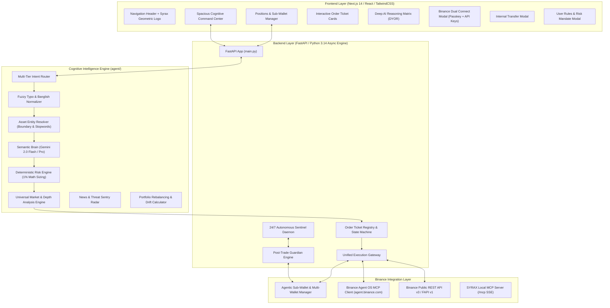
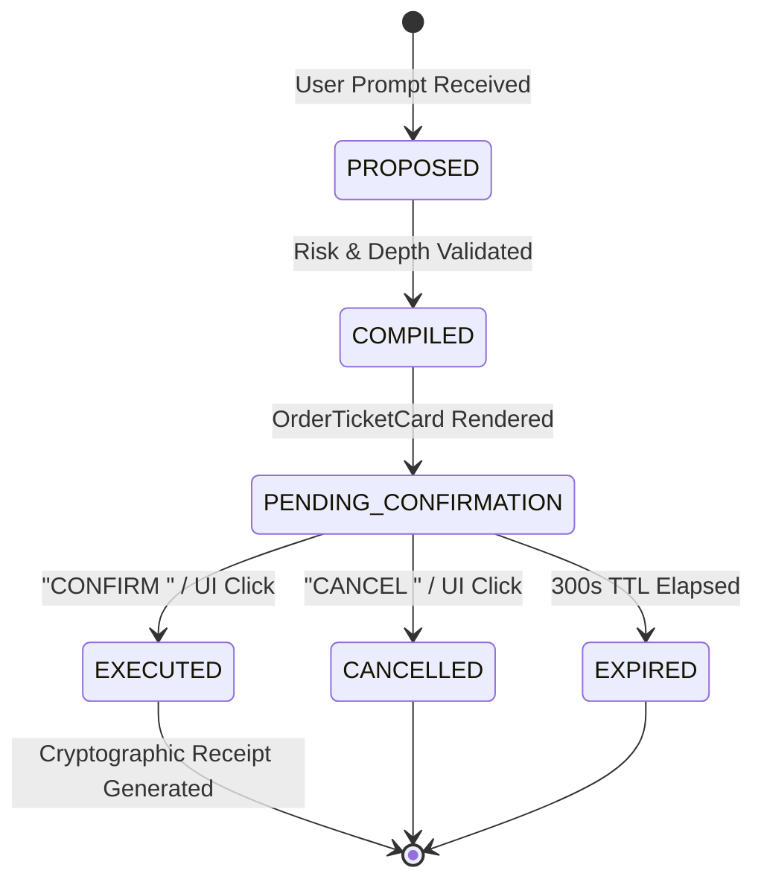

# ⚡ SYRAX — Complete System Architecture & Feature Reference Manual
**Binance Agent OS Autonomous AI Trading & Portfolio Intelligence Platform**

---

## Table of Contents
1. [Executive Summary & System Identity](#1-executive-summary--system-identity)
2. [End-to-End System Architecture](#2-end-to-end-system-architecture)
3. [Cognitive AI Brain & NLP Pipeline](#3-cognitive-ai-brain--nlp-pipeline)
4. [Deterministic Risk Engine & Safety Invariants](#4-deterministic-risk-engine--safety-invariants)
5. [Order Ticket State Machine & Execution Gateway](#5-order-ticket-state-machine--execution-gateway)
6. [24/7 Autonomous Sentinel & Post-Trade Guardian](#6-247-autonomous-sentinel--post-trade-guardian)
7. [Binance Connectivity & MCP Integration](#7-binance-connectivity--mcp-integration)
8. [Multi-Wallet Ecosystem & Internal Transfer Engine](#8-multi-wallet-ecosystem--internal-transfer-engine)
9. [UI/UX Components & Visual Identity](#9-uiux-components--visual-identity)
10. [Universal Asset Intelligence & Market Scanning](#10-universal-asset-intelligence--market-scanning)
11. [Complete REST API & MCP Server Endpoint Reference](#11-complete-rest-api--mcp-server-endpoint-reference)
12. [Verification Suite & Testing Protocols](#12-verification-suite--testing-protocols)

---

## 1. Executive Summary & System Identity

### 1.1 What is SYRAX?
**SYRAX** is a next-generation, autonomous AI crypto trading and sub-account portfolio intelligence platform built specifically for the **Binance Agent OS Hackathon**. It combines deep large-language-model reasoning with deterministic mathematical risk guardrails, real-time Binance market depth analysis, multi-turn conversational execution (in both English and Banglish), 24/7 post-trade surveillance, and native Model Context Protocol (MCP) tool bindings.

### 1.2 Core Design Principles
1. **Research. Reason. Risk. Execute.** — No trade is ever placed without verifiable multi-timeframe market evidence, explicit mathematical risk sizing, and human-in-the-loop authorization.
2. **Deterministic Risk Invariant (1.0% Hard Cap)** — Mathematical risk gating is hardcoded in Python and strictly enforced by the execution gateway; the AI model cannot hallucinate or bypass capital risk boundaries.
3. **Sub-Account Isolation** — Dedicated delegated trading budget isolation ensures that main Binance account funds are quarantined from automated agent operations.
4. **Transparent Explainability & DYOR Compliance** — Every trade proposal contains full bull/bear theses, invalidation conditions, conviction metrics, and prominent **DYOR (Do Your Own Research)** compliance notices.
5. **Zero-Friction Usability** — Supports natural conversational input (including colloquial Banglish expressions), 1-click browser passkey login, direct API keys, and instant internal transfers.

---

## 2. End-to-End System Architecture

---

## 3. Cognitive AI Brain & NLP Pipeline

### 3.1 Typo Normalization & Multi-Lingual Fuzzy Engine
The `FuzzyTextNormalizer` handles spelling errors, abbreviations, and phonetic Banglish variants:
- **Trading Verbs:** `analize` $\to$ `analyze`, `odrer` $\to$ `order`, `levarge` $\to$ `leverage`, `cancle` $\to$ `cancel`.
- **Banglish Keywords:**
  - `kemon` / `kemn` / `kamn` $\to$ Market condition evaluation request.
  - `kinte` / `kinbo` / `kinnte` $\to$ Buy / Long intent.
  - `bechte` / `bikri` $\to$ Sell / Short intent.
  - `obostha` / `ovosta` $\to$ Status / Health query.
  - `shob` / `sobgula` $\to$ Global portfolio / All positions.
  - `kothay koto ache` $\to$ Multi-wallet balance breakdown query.

### 3.2 Multi-Tier Intent Router (`IntentRouter`)
Processes inputs through hierarchical classification tiers:
1. **`CONVERSATION`** — Greetings, capability queries, educational AI assistance.
2. **`EXPLANATION`** — Concept breakdowns (e.g. "What is Funding Rate?", "How does 1% risk protect me?").
3. **`MARKET_ANALYSIS`** — Technical, volume, spread, RSI, and orderbook evaluation (tagged with `DYOR`).
4. **`EXPLORATION / DISCOVERY`** — Market scans (e.g. "Find best opportunity with <1% risk", "Show top alpha gainers").
5. **`PORTFOLIO`** — Asset holdings, unrealized PnL, cash reserves, target drift.
6. **`TRADE_PLAN`** — Compilation of risk-gated limit or market order tickets.
7. **`TRADE_CONFIRMATION`** — Exact token verification (`CONFIRM <PARENT_ORDER_ID>`).
8. **`CANCEL_ORDER`** — Explicit cancellation (`CANCEL <PARENT_ORDER_ID>`).
9. **`CLOSE_POSITION`** — Immediate position exit.
10. **`INTERNAL_TRANSFER`** — Cross-wallet funds movement between Spot, Funding, Futures, Margin, and Earn.
11. **`EMERGENCY_PROTECT`** — Immediate capital quarantine into stablecoins.
12. **`CONVERT`** — Zero-fee Binance Convert transactions.
13. **`REBALANCE`** — Portfolio realignment to target percentage corridors.

### 3.3 Strict Asset Entity Resolver (`ProductAwareResolver`)
- **Boundary Validation:** Matches 350+ Binance Spot and USDⓈ-M Futures pairs.
- **Stopword Exclusion:** Eliminates false positives (e.g. `FOR`, `IN`, `AND`, `ON`, `ALL`, `CAN`, `NOW`, `ME`).
- **Commodity/Stock Disclaimers:** Clarifies non-crypto requests (e.g. Crude Oil, Gold, Apple stock) with appropriate synthetic or Paxos Gold (`PAXGUSDT`) proxies.

---

## 4. Deterministic Risk Engine & Safety Invariants

### 4.1 The 1.0% Hard Account Risk Cap
The mathematical risk invariant prevents catastrophic account drawdowns:
$$\text{Max Risk USD} = \text{Sub-Wallet Capital} \times \frac{\text{Max Risk \%}}{100}$$
$$\text{Allowed Order Notional} = \frac{\text{Max Risk USD}}{|\text{Entry Price} - \text{Stop Loss Price}| / \text{Entry Price}}$$

- If a user requests a position size exceeding this formula, SYRAX automatically rescales the notional size downwards to strictly comply with the risk cap.

### 4.2 Mandatory Protective Orders
- **No Naked Positions:** Every trade compiled by SYRAX requires an explicit **Stop-Loss (SL)** and **Take-Profit (TP)** level.
- **Dynamic ATR Sizing:** Stop losses are automatically placed beyond structural support/resistance zones (default 1.8%–2.5% distance).

---

## 5. Order Ticket State Machine & Execution Gateway

### 5.1 Interactive UI Execution Ticket
- **Parent Order ID:** e.g. `TKT-2026-98124`
- **Confirmation Token:** Exact token string `CONFIRM TKT-2026-98124`
- **Order Details:** Side (BUY/SELL), Market Type (SPOT/FUTURES/MARGIN), Notional Size, Leverage ($1\times\text{--}10\times$), Limit Price, SL, TP, Risk/Reward Ratio ($>2.0\text{ R:R}$).
- **Partial Fill Simulation Slider:** Allows simulating $25\%$, $50\%$, $75\%$, or $100\%$ fill events for thorough hackathon verification.

---

## 6. 24/7 Autonomous Sentinel & Post-Trade Guardian

### 6.1 Post-Trade Guardian Engine (`guardian.py`)
Runs concurrently in the background:
- **Dynamic Trailing Stop Loss:** Activates once a position reaches $+3.0\%$ PnL, trailing behind peak price by $1.5\%$ callback to lock in gains.
- **Maximum Drawdown Circuit Breaker:** If overall portfolio equity drops $\ge 5.0\%$ from its peak valuation ($500.00$), trading is instantly paused and risk assets are placed in quarantine.
- **Concentration Limits:** Prevents any single asset from exceeding $40\%$ of total sub-account equity.
- **Exposure Cap:** Enforces maximum simultaneous derivative leverage exposure.

---

## 7. Binance Connectivity & MCP Integration

| Connection Mode | Description | Security Model |
| :--- | :--- | :--- |
| **Agent OS MCP Passkey** | 1-Click Browser SSO authorization via `https://agent.binance.com/mcp/agentic` | PKCE $S256$, Biometric Passkey / 2FA, Scoped Sub-Account |
| **Direct API Keys** | Standard Binance API Key & Secret Key with Network switch (**Testnet** vs **Mainnet**) | HMAC-SHA256 signature, IP Whitelist, Read + Trade permissions only |
| **Local MCP Server** | Exposes SYRAX trading tools via Server-Sent Events at `/mcp` | Standard Model Context Protocol (Claude / Agent compatible) |

---

## 8. Multi-Wallet Ecosystem & Internal Transfer Engine

### 8.1 Supported Binance Wallets

| Wallet ID | Name | Role & Balances |
| :--- | :--- | :--- |
| `SPOT` | **Fiat & Spot** | Main spot trading, token conversions, deposits (USDT, BTC, ETH, SOL, USDC) |
| `FUNDING` | **Funding Wallet** | P2P trading, Binance Pay, crypto card payments (USDT, FDUSD, BNB) |
| `USDT_FUTURES` | **USDⓈ-M Futures** | Perpetual & delivery contracts with USDT/USDC collateral |
| `COIN_FUTURES` | **Coin-M Futures** | Crypto-settled delivery contracts (BTC, ETH collateral) |
| `CROSS_MARGIN` | **Cross Margin (3x/5x)** | Unified multi-asset leveraged spot portfolio |
| `EARN` | **Simple Earn & Staking** | Flexible yield and staking interest products |

### 8.2 Zero-Fee Internal Transfer Engine
- **Instant Execution:** Transfers funds between any two internal wallets deterministically with 0% fees.
- **Audit Receipt:** Generates immutable transaction IDs (`XFER-XXXXXXXX`) and transfer logs.
- **Interactive UI:** Features dropdowns for source/destination wallets, asset selector, `MAX` balance button, and instant visual confirmation.

---

## 9. UI/UX Components & Visual Identity

### 9.1 Minimalist Geometric SYRAX Logo
- **Icon:** Sharp geometric `S` monogram with an integrated upward market trajectory arrow ($\nearrow$) in negative space.
- **Color Palette:** High-contrast **Electric Cyan (`#00E5FF`)** and **Pure White (`#FFFFFF`)** on **Obsidian Black (`#080C14`)**.
- **Philosophy:** Clean modern Web3 fintech silhouette, zero gradients, no robot clichés, distinctly differentiated from Binance.

### 9.2 Automatic DYOR Badging
- **Message Header Badge:** Rendered in amber whenever market analysis or token outlook is requested.
- **Side Footer Tag:** `🛡️ DYOR • Do Your Own Research • Not Financial Advice` at the bottom of analysis message bubbles.
- **Deep Reasoning Matrix:** Prominent `DYOR` badge alongside conviction percentage.

---

## 10. Universal Asset Intelligence & Market Scanning

- **Category Filtering:** `ALL`, `FUTURES`, `SPOT`, `ALPHA` (Breakout gainers $>5\text{M}$ volume).
- **Orderbook Telemetry:** Real-time calculation of bid/ask spread (in basis points `bps`), slippage risk, and orderbook replenishment speed.
- **Today's P&L Engine:** Realized + Unrealized P&L tracked in real-time from `00:00:00 UTC` reset cycle.

---

## 11. Complete REST API & MCP Server Endpoint Reference

### Market & AI Endpoints
- `GET /api/market/scan?category=ALL&limit=25` — Scans ranked opportunities.
- `GET /api/market/search?q=SOL` — Search Binance listed pairs.
- `GET /api/market/symbol/{symbol}` — Deep-dive orderbook depth and technicals.
- `GET /api/market/klines?symbol=BTCUSDT&interval=1h&limit=100` — Candlestick charts.
- `POST /api/chat` — Main conversational natural language loop.

### Sub-Wallet & Multi-Wallet Endpoints
- `GET /api/subwallet` — Sub-wallet balances, active trades, and PnL breakdown.
- `GET /api/wallets/summary` — Overview of all 6 Binance internal wallets.
- `POST /api/wallets/transfer` — Execute zero-fee internal transfer.
- `GET /api/wallets/transfers` — Internal transfer audit log.
- `POST /api/subwallet/order` — Place market order.
- `POST /api/subwallet/limit-order` — Place pending limit order.
- `POST /api/subwallet/order/simulate-fill` — Simulate partial/full fill.
- `POST /api/subwallet/trade/close` — Close ongoing trade.
- `POST /api/subwallet/trade/update` — Update SL/TP levels.
- `POST /api/subwallet/sell-holding` — Sell spot holding.
- `POST /api/subwallet/rebalance/execute` — Execute automatic portfolio rebalance.

### Order Ticket State Endpoints
- `GET /api/ticket/{ticket_id}` — Retrieve compiled order ticket.
- `POST /api/ticket/confirm` — Confirm and execute order ticket.
- `POST /api/ticket/cancel` — Cancel order ticket.
- `GET /api/tickets/pending` — List pending unexpired tickets.

### Sentinel & Guardian Endpoints
- `GET /api/monitor/status` — 24/7 background sentinel status.
- `POST /api/monitor/toggle` — Pause / Resume sentinel.
- `GET /api/guardian/status` — Post-trade Guardian parameters and equity peak.
- `GET /api/guardian/incidents` — Incident log and circuit breaker events.
- `POST /api/guardian/config` — Update Guardian trailing stop and drawdown settings.

### Binance MCP & API Key Endpoints
- `GET /api/binance/status` — Check API key connectivity.
- `POST /api/binance/connect` — Connect Binance API Key and Secret (Testnet/Mainnet).
- `GET /api/binance/mcp/status` — Check Binance Agent OS MCP connection.
- `POST /api/binance/mcp/connect` — Connect authorized MCP bearer token.
- `POST /api/binance/mcp/disconnect` — Graceful MCP disconnect.
- `GET /api/binance/oauth/initiate` — Generate 1-click browser passkey authorization URL.
- `GET /mcp` — SYRAX local MCP Server-Sent Events (SSE) tool endpoint.

---

## 12. Verification Suite & Testing Protocols

- **End-to-End Test Suite:** Located in `test_phase6_7_e2e.py` and `test_today_pnl_engine.py`.
- **FastAPI Backend:** Runs asynchronously on port `8001` with automated reload.
- **Next.js Frontend:** Hot-reloaded and running on port `3001`.
- **Zero Linter/Type Errors:** Validated across Python type hints and TypeScript strict interfaces.
